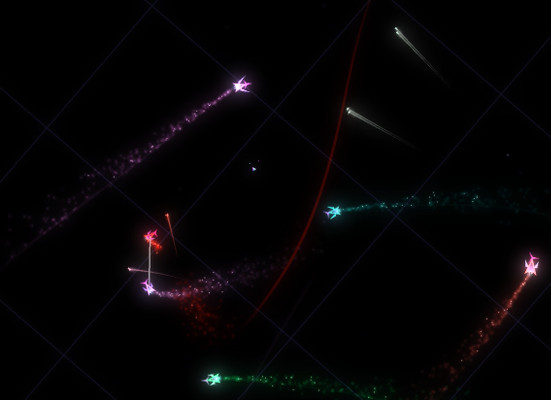

# Modding the Vibrant game

Vibrant is a fun game to play. But after some levels passed I get bored with low gameplay variability. Also came ideas on things can be added for more fun. So comes this modding.

## Changes so far

### Controls

Strafe (that was Alt key before) now ON on default. So now left-right keys do strafe and holding Alt make ship turns. But this is unnecessary, see below.
Turning ship supposed to do using the mouse left-right moves. Only x-axis used. Y-axis moves do nothing (by now).
Grag is always ON. Holding Space key to temporarily get it OFF (really needed only to get rid of trap).
Less cammera rotations (annoys too much).

### Powerups

Powerups rebalanced

Trap damage reduced. Life adds more life.

### Cheatcodes

Added:
JOY - increase energy replenish level (permanent effect)
LOL - invincibility for some long time
KEK - adds fire power (immensive result and make game slow and crash sometimes when overused)

Changed:
KISS - +30 levels

Still there:
NEXT - +1 level

### Other

Lifted firepower limit (for testing)

### TODO Ideas

AI/enemies - vary enemies, make them more aggressive;
Balance - alter ship upgrade limits;
Terrain - walls/gravity wells(attractors)/gravity hills(anti-attractors);
Weapons - bombs/novas/wave of bullets/laser beams;
More players - battle stations(flying cannons)/critters/bosses;
Do something clever with trap;

# Vibrant

Vibrant is a hectic experience of 2D shoot'em up action revolving around inertia and dog-fighting against vicious AIs. You'll meet increasingly numerous enemies in a blissful techno trance until you meet your fate.

You can find the game page here: http://gamesfrommars.fr/vibrant
or here: http://ponce.itch.io/vibrant

## How to build

It's very simple, especially on Windows.

- make sure you have DUB, the D package manager: https://code.dlang.org/download

- type `dub` in the root directory

- then the game will run but crash because of not finding the right dynamic libraries. You need SDL2 and SDL_mixer 2.0+
  * on Windows, copy DLLs from `32-bit dependencies/` or `64-bit dependencies/` directory
  * on Ubuntu/Debian, you'll need to install SDL2 and SDL2_mixer
  * on Mac, copy the executable in the bundle, along with relevant SDL2 and SDL2_mixer bundles. This is a bit tricky, look how its done on OS X release: http://gamesfrommars.fr/vibrant
  * on FreeBSD, install SDL2 and SDL2_mixer: `pkg  install sdl2 sdl2_mixer`

- type `dub` again to run

## License

The software is licensed under the Boost 1.0 software license.
The music's right are held by Nelson Rafael.

## Press coverage
Vibrant 1.5 has been featured in the Tigsource blog: https://www.tigsource.com/2010/10/01/vibrant/
and the Joystick magazine.

Now it's in 1.8 and the game is better than ever before, and is available on Windows and OS X.
If you want to build it yourself, it is also known to work on Linux and FreeBSD.
Past level 10 it takes a lot of concentration to achieve survival, and I think it could be a kind of brain exercise.
